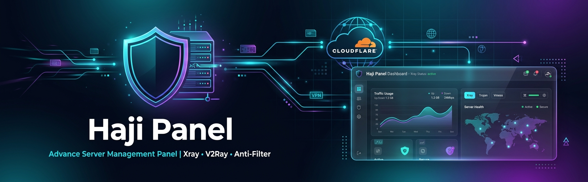

# 🛡️ Haji Panel - پنل مدیریت سرور ضد‌فیلتر



> سیستم کامل مدیریت سرور با ضد‌فیلتر، Xray، ربات تلگرام فروش VPN، نمایندگی، اسکنر آی‌پی تمیز و پنل گرافیکی

[](https://opensource.org/licenses/MIT)
[](https://ubuntu.com/)
[](https://github.com/XTLS/Xray-core)
[]()

---

## 🚀 نصب خودکار (یک خط)

```bash
bash <(curl -sL https://raw.githubusercontent.com/Sajjadsoli/haji-panel/main/scripts/install.sh)
```

### نصب دستی

```bash
git clone https://github.com/Sajjadsoli/haji-panel.git
cd haji-panel
chmod +x scripts/install.sh
sudo bash scripts/install.sh
```

بعد از نصب، دستور `haji` برای مدیریت کامل در دسترسه:

```bash
haji              # منوی مدیریت (۲۵ گزینه)
haji password     # تغییر رمز پنل
haji domain       # مدیریت دامنه + SSL خودکار
haji sub-domain   # دامنه نمایش ساب
haji security     # تنظیمات امنیتی
haji bot          # مدیریت ربات تلگرام
haji scanner      # اسکنر آی‌پی تمیز
```

---

## ✨ امکانات کامل

### 🛡️ ضد‌فیلتر چندلایه
- **Cloudflare Warp** - مخفی کردن IP سرور
- **DNS over HTTPS (DoH)** - دور زدن فیلتر DNS
- **Cloudflare CDN** - ضد‌فیلتر دامنه
- **SSL/HTTPS** - رمزنگاری ترافیک
- **Anti-detection** - مخفی کردن اطلاعات سرور از Nginx

### ⚡ Xray-core (مثل 3x-ui)
- نصب خودکار Xray-core آخرین نسخه
- پشتیبانی از: **VLESS, VMess, Trojan, Shadowsocks, Reality**
- سرویس systemd با auto-restart
- Routing و anti-bittorrent
- مدیریت از پنل و CLI

### 💎 اسکنر آی‌پی تمیز (مثل sMb-Scanner)
- اسکن خودکار Cloudflare/Gcore/Fastly
- **تست استرس واقعی** با Xray-core
- پیدا کردن **Diamond IPs** (تمیز، سریع، پینگ پایین)
- **تعویض خودکار** IP فیلتر شده
- **مولتی‌لوکیشن** - توزیع بین لوکیشن‌های مختلف
- تزریق خودکار IP تمیز در کانفیگ‌ها
- Cron job هر ۶ ساعت

### 🤖 ربات تلگرام فروش VPN (مثل میرزا بات)
- **فعال‌سازی خودکار** با توکن + آیدی مالک
- **ست خودکار وب‌هوک** - نیازی به کار اضافه نیست
- **مدیریت ادمین** - افزودن/حذف ادمین
- **فروش VPN** - خرید → پرداخت → تایید → تحویل کانفیگ
- **کیف پول** - موجودی، شارژ، کسر هنگام خرید
- **اکانت تستی** - رایگان با حجم/زمان قابل تنظیم
- **پرداخت کارت به کارت** - تصویر رسید → تایید/رد
- **پیام همگانی** - ارسال به همه/مشتریان/غیرمشتریان
- **زیرمجموعه‌گیری** - لینک دعوت + پورسانت
- **کد هدیه** - سیستم کد هدیه
- **عضویت اجباری کانال**
- **QR Code** برای کانفیگ‌ها
- **آمار فروش** - روزانه/هفتگی/ماهانه
- **یادآوری تمدید** - ۳ روز قبل
- **هشدار حجم** - ۸۰٪ مصرف

### 👥 سیستم نمایندگی (Reseller)
- نوع **حجمی** (محدود به GB) یا **نامحدود** (محدود به تعداد یوزر)
- **انقضای قابل تنظیم** + **۴ روز دوره تمدید**
- **حذف خودکار** بعد از دوره تمدید
- مالک می‌تونه: افزودن حجم/یوزر، تمدید، حذف
- هر نماینده: **API key + panel key + ربات اختصاصی**
- **Cron job** هر ساعت بررسی انقضا

### 🌐 مدیریت دامنه
- **۳ نوع دامنه مجزا**: پنل ادمین، کانفیگ، ساب‌لینک
- **SSL خودکار** با Let's Encrypt هنگام ثبت دامنه
- **Nginx خودکار** برای هر دامنه
- **Anti-detection** - دامنه‌های ناشناخته `return 444`
- مدیریت از پنل و CLI

### 🔒 امنیت کامل
- **ضد DDoS** - Rate limiting + Connection limit
- **Brute-force protection** - ۵ تلاش → ۱۵ دقیقه بن
- **CSRF protection** - توکن CSRF
- **Session timeout** - قابل تنظیم
- **IP whitelist** - محدود کردن دسترسی
- **2FA** - احراز هویت دو مرحله‌ای
- **Login logging** - ثبت تلاش‌های ورود
- **Security headers** - CSP, HSTS, X-Frame, XSS

### 🔑 امنیت ساب‌لینک
- هر ساب‌دامنه **کلید اختصاصی UUID** می‌گیره
- کاربر فقط با کلید خودش به پنلش دسترسی داره
- URL: `/panel/<access_key>` (عمومی، بدون ورود)
- API: `/api/k/<key>/status`, `/configs`, etc.

### 📊 پنل گرافیکی ساب‌لینک
- **دایره‌های پیشرفت** SVG برای حجم و زمان
- **چارت ترافیک** ساعتی
- **کانفیگ‌های قابل کپی** + QR Code
- **لینک اشتراک** (Subscription) برای کلاینت‌ها
- **وضعیت آی‌پی تمیز** + دکمه تعویض
- **برندینگ** - عنوان، رنگ، لوگو قابل تنظیم

### 🎨 طراحی
- **Glassmorphism** با backdrop-filter blur
- **گرادیان سایان/بنفش** با انیمیشن
- **کارت‌های شیشه‌ای** با hover glow
- **کاملاً RTL** و واکنش‌گرا
- فونت **Vazirmatn**

---

## 📋 پیش‌نیازها

| مورد | حداقل |
|------|-------|
| سیستم‌عامل | Ubuntu 20.04 / 22.04 / 24.04 |
| RAM | 512 MB |
| دسترسی | Root / Sudo |
| پورت‌ها | 80, 443, 8443 |

---

## 🖥️ دستورات CLI

| دستور | توضیحات |
|-------|---------|
| `haji` | منوی مدیریت (۲۵ گزینه) |
| `haji start` | شروع پنل |
| `haji stop` | توقف |
| `haji restart` | راه‌اندازی مجدد |
| `haji restart-xray` | راه‌اندازی Xray |
| `haji status` | وضعیت |
| `haji settings` | تنظیمات فعلی |
| `haji password` | تغییر رمز عبور |
| `haji domain` | مدیریت دامنه + SSL |
| `haji sub-domain` | دامنه ساب‌لینک |
| `haji security` | تنظیمات امنیتی |
| `haji bot` | مدیریت ربات تلگرام |
| `haji scanner` | اسکنر آی‌پی |
| `haji ssl` | مدیریت SSL |
| `haji firewall` | فایروال |
| `haji bbr` | فعال‌سازی BBR |
| `haji speedtest` | تست سرعت |
| `haji update` | آپدیت |
| `haji update-geo` | آپدیت فایل‌های Geo |
| `haji install` | نصب |
| `haji uninstall` | حذف |

---

## 📁 ساختار پروژه

```
haji-panel/
├── scripts/
│   ├── install.sh          # نصب خودکار + Xray + SSL + Cron
│   ├── haji-cli.sh         # CLI مدیریت (haji)
│   ├── anti-filter.sh      # ماژول ضد‌فیلتر
│   └── uninstall.sh        # حذف
├── panel/
│   ├── app.py              # بک‌اند پنل (Flask)
│   ├── templates/
│   │   ├── base.html       # قالب پایه
│   │   ├── dashboard.html  # داشبورد
│   │   ├── domains.html    # مدیریت دامنه + ساب‌دامنه
│   │   ├── ssl.html        # مدیریت SSL
│   │   ├── anti-filter.html # ضد‌فیلتر
│   │   ├── firewall.html   # فایروال
│   │   ├── settings.html   # تنظیمات + برندینگ + ربات + اسکنر + نمایندگی
│   │   ├── subdomain_panel.html # پنل گرافیکی ساب‌لینک
│   │   └── login.html      # ورود
│   └── static/
│       ├── css/style.css   # استایل Glassmorphism
│       └── js/app.js       # فرانت‌اند
├── core/
│   ├── anti_filter.py      # منطق ضد‌فیلتر
│   ├── domain_manager.py   # مدیریت دامنه
│   ├── ssl_manager.py      # مدیریت SSL
│   ├── server_monitor.py   # مانیتورینگ سرور
│   ├── traffic_monitor.py  # مانیتورینگ حجم/زمان + کانفیگ‌ها
│   ├── ip_scanner.py       # اسکنر آی‌پی تمیز
│   ├── telegram_bot.py     # ربات تلگرام فروش VPN
│   ├── reseller.py         # سیستم نمایندگی
│   └── security.py         # امنیت پنل
├── nginx/
│   └── default.conf        # کانفیگ Nginx + ضد DDoS
├── assets/
│   └── banner.jpeg         # بنر پروژه
├── docs/
│   ├── INSTALL.md          # راهنمای نصب
│   └── CONFIG.md           # راهنمای کانفیگ
└── README.md
```

---

## 🛡️ لایه‌های ضد‌فیلتر

```
┌─────────────────────────────────────────┐
│  لایه ۱: Cloudflare Warp (IP مخفی)      │
├─────────────────────────────────────────┤
│  لایه ۲: DNS over HTTPS (DoH)           │
├─────────────────────────────────────────┤
│  لایه ۳: Cloudflare CDN (ضد‌فیلتر دامنه) │
├─────────────────────────────────────────┤
│  لایه ۴: SSL/HTTPS (رمزنگاری)           │
├─────────────────────────────────────────┤
│  لایه ۵: Diamond IP (آی‌پی تمیز اسکن شده)│
├─────────────────────────────────────────┤
│  لایه ۶: Anti-detection (مخفی کردن سرور) │
└─────────────────────────────────────────┘
```

---

## 🆘 پشتیبانی

- [گزارش باگ](https://github.com/Sajjadsoli/haji-panel/issues)
- [درخواست فیچر](https://github.com/Sajjadsoli/haji-panel/issues)

---

## 📜 لایسنس

MIT License - استفاده آزاد

---

<div align="center">

**ساخته شده با ❤️ برای اینترنت آزاد**


[نصب سریع](#-نصب-خودکار-یک-خط) • [راهنمای کامل](docs/INSTALL.md) • [کانفیگ](docs/CONFIG.md) • [CLI](#-دستورات-cli)

</div>
